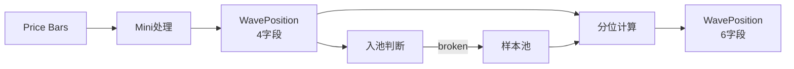

# 功能流程图

**图解**: 数据如何流动  
**更新日期**: 2026-11-23

---

## 🎯 Mini版流程

```mermaid
flowchart LR
    A[Price Bars] --> B[极值识别]
    B --> C[HH/HL/LL/LH]
    C --> D[状态机]
    D --> E[寿命记录]
    E --> F[WavePosition<br/>4字段]
```

---

## 🎯 Plus版流程

```mermaid
flowchart LR
    A[Price Bars] --> B[Mini处理]
    B --> C[WavePosition<br/>4字段]
    C --> D[入池判断]
    D -->|broken| E[样本池]
    C --> F[分位计算]
    E --> F
    F --> G[WavePosition<br/>6字段]
```

---

**状态**: ✅ 完整

