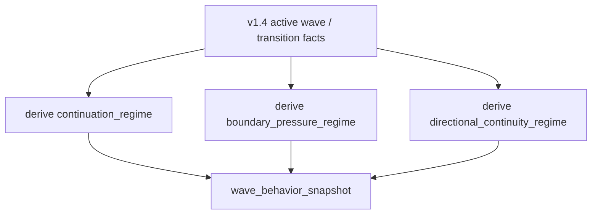

# MALF v1.5 Core Chart View

日期：2026-05-16

```mermaid
flowchart TD
    A["v1.4 active wave / transition facts"] --> B["derive continuation_regime"]
    A --> C["derive boundary_pressure_regime"]
    A --> D["derive directional_continuity_regime"]
    B --> E["wave_behavior_snapshot"]
    C --> E
    D --> E
```

说明：

- Core 图只说明结构行为从哪里来。
- 它不说明强弱结论，更不说明交易动作。
