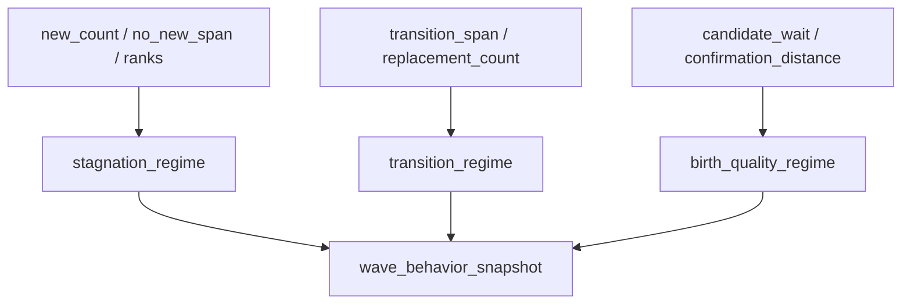

# MALF v1.5 Lifespan Chart View

日期：2026-05-16

```mermaid
flowchart TD
    A["new_count / no_new_span / ranks"] --> B["stagnation_regime"]
    C["transition_span / replacement_count"] --> D["transition_regime"]
    E["candidate_wait / confirmation_distance"] --> F["birth_quality_regime"]
    B --> G["wave_behavior_snapshot"]
    D --> G
    F --> G
```

说明：

- Lifespan 图只说明行为压力与出生质量。
- 它不输出预测，不输出 setup，不输出订单。
