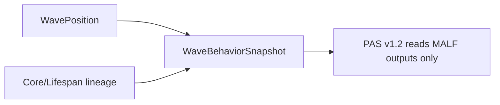

# MALF v1.5 Service Chart View

日期：2026-05-16

```mermaid
flowchart LR
    A["WavePosition"] --> C["WaveBehaviorSnapshot"]
    B["Core/Lifespan lineage"] --> C
    C --> D["PAS v1.2 reads MALF outputs only"]
```

服务层说明：

- `WaveBehaviorSnapshot` 是 MALF 输出。
- PAS 只能读，不得写。
- 下游不得把它解释成 broker、收益或仓位接口。
